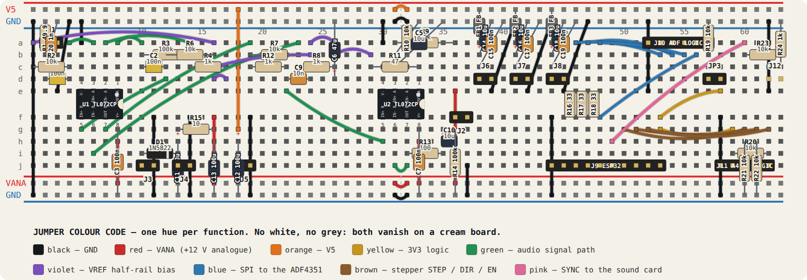

# breadboard — the baseband board

Everything between the mixer's IF port and the USB audio interface, plus the
power entry and the ESP32 / ADF4351 harness, on one 830-point breadboard:
video amplifier, half-rail reference, 12 V input, sync divider.

| folder | what |
|---|---|
| [`schematics/`](schematics/) | three KiCad sheets and their PNGs: `radar_flow` (how everything connects, in signal order), `radar_breadboard` (the board at component level), `radar_multisim` (each test block drawn alone with its sources and expected readings) |
| [`layout/`](layout/) | the board: [`WIRING.md`](layout/WIRING.md) gives every part's lead → hole, every jumper and every net, verified against the schematic netlist; [`breadboard.html`](layout/breadboard.html) is the interactive version (hover or click any part, wire, net or hole) |
| [`assembly/`](assembly/) | [`ASSEMBLY.md`](assembly/ASSEMBLY.md): the build in 17 pictured steps, each ending with a check |
| [`parts/`](parts/) | [`PARTS.md`](parts/PARTS.md), the stockroom pick list (every value, how many, what may be substituted), and [`MODULES.md`](parts/MODULES.md), the pinouts of the TL072, ESP32, A4988, ADF4351 and the interface |
| [`multisim/`](multisim/) | the SPICE netlists for each block, ready for File ▸ Open in Multisim, with the reading each should give |

## Multisim status

The netlists in `multisim/import/` open directly in Multisim and each header
says which analysis to run and what number to expect. The saved Multisim
projects (`.ms14`) and the bench measurements go in `multisim/` beside them (the `.sub` black-box blocks for Route B are in `multisim/blocks/`)
once each block has been run.

| block | file | expect |
|---|---|---|
| 1 video amplifier | `import/01_video_amp.cir` | 54.5 dB at 1 kHz; 0.5 mVpk in → 0.27 Vpk out |
| 2 half-rail reference | `import/02_vref_bias.cir` | vref 5.58–5.70 V |
| 3 12 V input | `import/03_power_in.cir` | vana 11.58 V |
| 4 reverse polarity | `import/04_power_reverse.cir` | vprot −0.11 mV |
| 5 sync divider | `import/05_sync_div.cir` | sync 283 mV |
| 6 IF input network | `import/06_if_input.cir` | −6.7 dB at 417 Hz, −57.7 dB at 2.44 GHz |
