# Building the breadboard, step by step

Seventeen steps. Each one adds a handful of parts, ends with something you can
measure, and has a picture of the board as it should look when you are done.
**Build in this order**: power first so every later stage has something to run
on, then the op-amps, then the signal left to right, then the digital side.

Generated by `layout.py` from the same placement the schematic check runs
against, so these steps cannot drift from [`WIRING.md`](WIRING.md) or from the
board. `python3 layout.py` rebuilds the lot.

## Before you start

| | |
|---|---|
| board | 830-point breadboard. Columns **1–63** left to right; rows **a–e** are the top bank, **f–j** the bottom. The five holes of one column in one bank are a single strip. |
| hole names | `b14` = row b, column 14. `TR-@12` = the **top blue** rail, hole nearest column 12 — on a real board just use the closest free rail hole. |
| rails | top red **V5**, top blue **GND**, bottom red **VANA** (+12 V analogue), bottom blue **GND**. |
| tools | a fine pair of snips, tweezers, a multimeter. No soldering: everything here pushes in. |

### The jumper colour code

One hue per function, so a finished board can be read at a glance and a wire in
the wrong place stands out. Nothing electrical depends on it — if your jumper
kit is short of a colour, substitute one and note it on the sheet.

| colour | carries |
|---|---|
| **black** | GND — 17 wires |
| **red** | VANA (+12 V analogue) — 5 wires |
| **orange** | V5 — 2 wires |
| **yellow** | 3V3 logic — 2 wires |
| **green** | audio signal path — 9 wires |
| **violet** | VREF half-rail bias — 5 wires |
| **blue** | SPI to the ADF4351 — 4 wires |
| **brown** | stepper STEP / DIR / EN — 3 wires |
| **pink** | SYNC to the sound card — 1 wire |

There is deliberately **no white and no grey wire** anywhere in this build: on a
cream breadboard both disappear, and the three stepper lines and the SYNC line
used to be exactly that. They are brown and pink now.

---

## Step 1 — Rails, bridged and tied

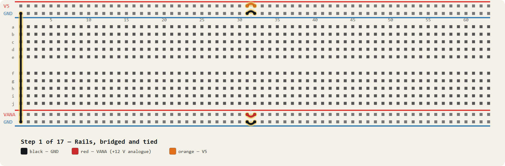

Nothing works until the four rails carry what they claim. Many 830-point boards split every rail at the middle, so the right-hand half of each is dead until you bridge it — and a split you did not notice is the classic reason half a board is unpowered. The last wire ties the two GND rails into one ground.

| wire | colour | from → to | what it does |
|---|---|---|---|
| 1 | orange | **TR+@31** → **TR+@32** | rail bridge (omit if your rails are continuous) |
| 2 | black | **TR-@31** → **TR-@32** | rail bridge |
| 3 | red | **BR+@31** → **BR+@32** | rail bridge |
| 4 | black | **BR-@31** → **BR-@32** | rail bridge |
| 5 | black | **TR-@1** → **BR-@1** | tie the two GND rails together |

> **Check before moving on.** Continuity from each rail's far left hole to its far right hole. If your board's rails are continuous, these four bridges are harmless.

---

## Step 2 — 12 V in, and the diode that saves the board

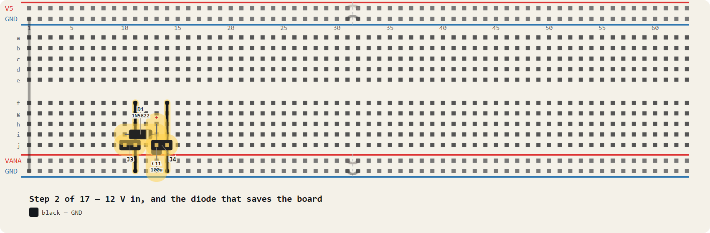

J3 takes the 12 V supply. D1 is a series Schottky: get the supply backwards and it simply does not conduct, instead of taking the op-amps and the electrolytics with it. The band on the diode body is the cathode and it faces RIGHT, toward column 13. C11 is the bulk reservoir on the protected side.

| part | value | push it in at |
|---|---|---|
| J3 | 12V IN | 1→**j10**, 2→**j11** |
| D1 | 1N5822 | A→**i10**, K→**i13** |
| C11 | 100u | 1→**h13**, 2→**BR-@13** |
| J4 | TO BUCK IN | 1→**j13**, 2→**j14** |

| wire | colour | from → to | what it does |
|---|---|---|---|
| 1 | black | **f11** → **BR-@11** | J3 GND |
| 2 | black | **f14** → **BR-@14** | J4 GND |

> **Check before moving on.** D1's band toward column 13. C11's + leg toward column 13, its - to the GND rail.

---

## Step 3 — The VANA rail — clean 12 V for the op-amps

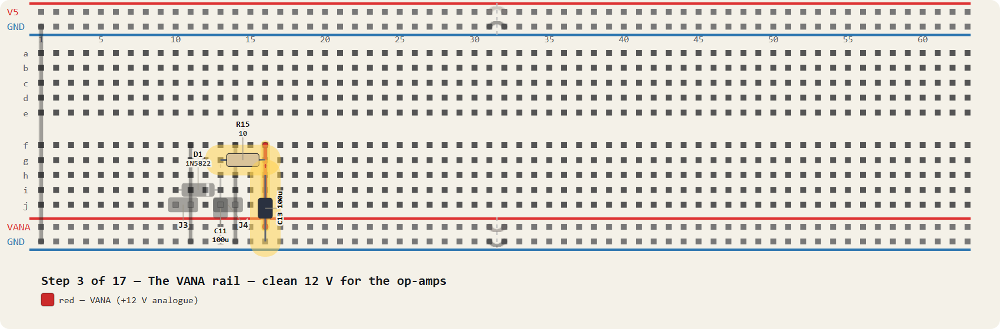

R15 and C13 are an RC filter, not a resistor someone forgot to remove: 10 ohms into 100 uF rolls off at about 160 Hz, which keeps supply noise out of an amplifier whose whole job is a signal down at 20 mV. The output of that filter is what feeds the bottom red rail.

| part | value | push it in at |
|---|---|---|
| R15 | 10 | 1→**g13**, 2→**g16** |
| C13 | 100u | 1→**h16**, 2→**BR-@16** |

| wire | colour | from → to | what it does |
|---|---|---|---|
| 1 | red | **f16** → **BR+@16** | VANA node (R15/C13) feeds the bottom red rail |

> **Check before moving on.** Bottom red rail now sits at 12 V minus the diode drop, about 11.6 V.

---

## Step 4 — 5 V in from the buck converter

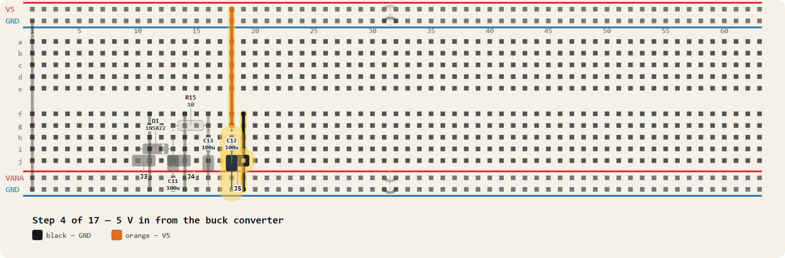

J5 brings 5 V back from the LM2596 after you have set it with nothing else connected. C12 decouples it and the orange wire carries it up to the top red rail, which is what the three RF modules will feed from.

| part | value | push it in at |
|---|---|---|
| J5 | FROM BUCK 5V | 1→**j18**, 2→**j19** |
| C12 | 100u | 1→**h18**, 2→**BR-@18** |

| wire | colour | from → to | what it does |
|---|---|---|---|
| 1 | black | **f19** → **BR-@19** | J5 GND |
| 2 | orange | **g18** → **TR+@18** | V5 (J5/C12, bottom col 18) up to the top red rail |

> **Check before moving on.** Set the buck to 5.00 V BEFORE this wire goes in. Top red rail = 5.00 V.

---

## Step 5 — Seat the two op-amps

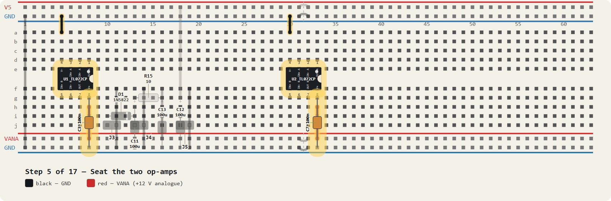

U1 is the two gain stages, U2 the reference buffer and the output. Both straddle the centre channel so the two sides of the package land on separate strips. The notch and the pin-1 dot face RIGHT, toward the higher column. C3 and C7 are the 100 nF decouplers and they go right at pin 8 of each chip, not somewhere tidier.

| part | value | push it in at |
|---|---|---|
| U1 | TL072CP | 4→**e5**, 3→**e6**, 2→**e7**, 1→**e8**, 5→**f5**, 6→**f6**, 7→**f7**, 8→**f8** |
| U2 | TL072CP | 4→**e30**, 3→**e31**, 2→**e32**, 1→**e33**, 5→**f30**, 6→**f31**, 7→**f32**, 8→**f33** |
| C3 | 100n | 1→**g8**, 2→**BR-@8** |
| C7 | 100n | 1→**g33**, 2→**BR-@33** |

| wire | colour | from → to | what it does |
|---|---|---|---|
| 1 | black | **a5** → **TR-@5** | U1 pin 4 (V-, top col 5) to the GND rail |
| 2 | black | **a30** → **TR-@30** | U2 pin 4 (V-, top col 30) to the GND rail |
| 3 | red | **h8** → **BR+@8** | U1 pin 8 (V+, bottom col 8) to the VANA rail |
| 4 | red | **h33** → **BR+@33** | U2 pin 8 (V+, bottom col 33) to the VANA rail |

> **Check before moving on.** Pin 1 at e8 (U1) and e33 (U2). Power the board: both chips should sit at room temperature. A warm op-amp means V+ and V- are swapped.

---

## Step 6 — The half-rail reference

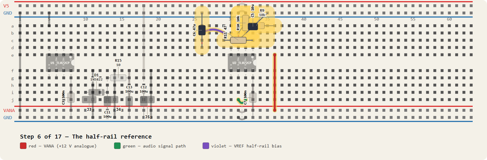

This amplifier runs on a single supply, so 'zero' has to be manufactured: R9 and R10 divide VANA in half at column 31, C5 holds it still, and U2's second half buffers it so the divider is not loaded by everything downstream. R11 and C6 carry that buffered VREF to the node the whole signal chain hangs off.

| part | value | push it in at |
|---|---|---|
| R9 | 10k | 1→**a36**, 2→**a31** |
| R10 | 10k | 1→**b31**, 2→**TR-@33** |
| C5 | 10u | 1→**c31**, 2→**TR-@35** |
| R11 | 47 | 1→**c33**, 2→**c29** |
| C6 | 47u | 1→**d26**, 2→**TR-@26** |

| wire | colour | from → to | what it does |
|---|---|---|---|
| 1 | red | **e36** → **BR+@36** | R9's VANA end (top col 36) down to the VANA rail |
| 2 | green | **j32** → **j31** | U2 pin 7 (col 32) to pin 6 (col 31): unity-gain buffer |
| 3 | green | **a33** → **a32** | U2 pin 1 (col 33) to pin 2 (col 32): VREF buffer, unity gain |
| 4 | violet | **b29** → **b26** | R11's far end (col 29) to the VREF node (col 26) |

> **Check before moving on.** VREF (column 26) should read half of VANA, about 5.8 V, and be steady.

---

## Step 7 — Spread VREF along the board

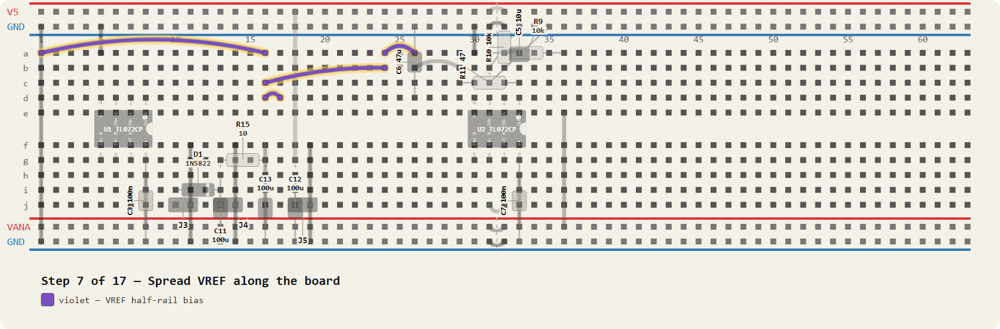

Four violet wires, and they are the reason the amplifier has a zero to swing about. The long one runs the length of row a to reach the input stage at column 1. Do them as a set so none is forgotten — a stage whose VREF is missing is not dead, it is railed, which is a more confusing symptom.

| wire | colour | from → to | what it does |
|---|---|---|---|
| 1 | violet | **a26** → **a24** | VREF -> C9's VREF end |
| 2 | violet | **b24** → **c16** | VREF -> R6's VREF end (col 16) |
| 3 | violet | **d16** → **d17** | VREF (col 16) -> R4's VREF end (col 17) |
| 4 | violet | **a1** → **a16** | VREF -> R2's VREF end (col 1): long run along row a |

> **Check before moving on.** Every violet wire end reads the same 5.8 V.

---

## Step 8 — The input: mixer IF, terminated

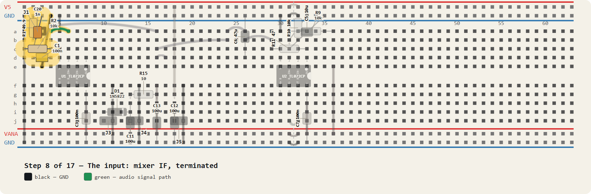

R1 is the 49.9 ohm load the mixer's IF port wants; without it the conversion loss and the flatness wander. C20 shunts the LO that leaks out of that same port at 2.4 GHz, which a TL072 would otherwise rectify into a DC offset. C1 and R2 are the first high-pass, and they are what stop the TX leakage tone from saturating the gain.

| part | value | push it in at |
|---|---|---|
| J1 | MIXER IF | 1→**a2**, 2→**a3** |
| R1 | 49.9 | 1→**b2**, 2→**TR-@2** |
| C20 | 1n | 1→**c2**, 2→**TR-@3** |
| C1 | 100n | 1→**d2**, 2→**d4** |
| R2 | 10k | 1→**c4**, 2→**c1** |

| wire | colour | from → to | what it does |
|---|---|---|---|
| 1 | black | **e3** → **TR-@4** | J1 GND |
| 2 | green | **a4** → **a6** | AP (C1/R2 node) into U1 pin 3 (IN+ A, col 6) |

> **Check before moving on.** R1 across the IF input reads 49.9 ohms to ground.

---

## Step 9 — Gain stage A, times 101

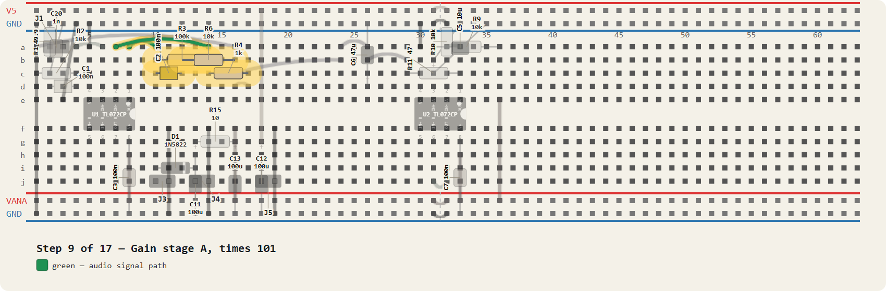

R3 over R4 sets the gain. R4 is 1k for the full 40 dB, but fit 4.7k on first power-up for a gain of 22: if the TX leakage is stronger than you expected, a lower first gain is the difference between seeing it and clipping on it. C2 and R6 are the second high-pass into stage B.

| part | value | push it in at |
|---|---|---|
| R3 | 100k | 1→**b14**, 2→**b10** |
| C2 | 100n | 1→**c10**, 2→**c12** |
| R4 | 1k | 1→**c14**, 2→**c17** |
| R6 | 10k | 1→**b12**, 2→**b16** |

| wire | colour | from → to | what it does |
|---|---|---|---|
| 1 | green | **a8** → **a10** | U1 pin 1 (OUT A, col 8) to the AOUT node (col 10) |
| 2 | green | **a14** → **a7** | AM node (R3/R4) back to U1 pin 2 (IN- A, col 7) |

> **Check before moving on.** Inject 10 mV at 1 kHz: about 107 mV out of stage A with R4 at 4.7k.

---

## Step 10 — Gain stage B, times 11, and the anti-alias corner

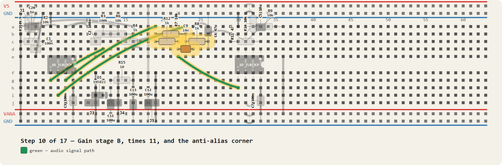

R7 over R8 gives the second 21 dB. R12 with C9 is the 15.9 kHz low-pass that limits the noise bandwidth reaching the sound card. The last wire takes that filtered node across the channel into U2's spare half.

| part | value | push it in at |
|---|---|---|
| R7 | 10k | 1→**b23**, 2→**b19** |
| R8 | 1k | 1→**c23**, 2→**c26** |
| R12 | 1k | 1→**c19**, 2→**c22** |
| C9 | 10n | 1→**d22**, 2→**d24** |

| wire | colour | from → to | what it does |
|---|---|---|---|
| 1 | green | **d12** → **g5** | BP (C2/R6 node) across the channel into U1 pin 5 (IN+ B, bottom col 5) |
| 2 | green | **g7** → **a19** | U1 pin 7 (OUT B, bottom col 7) up to the BOUT node (col 19) |
| 3 | green | **a23** → **i6** | BM node (R7/R8) across to U1 pin 6 (IN- B, bottom col 6) |
| 4 | green | **e22** → **h30** | LP (R12/C9 node) across to U2 pin 5 (IN+ B, bottom col 30) |

> **Check before moving on.** Total gain now about 61 dB. Sweep it: -3 dB at 15.9 kHz, -6 dB at 159 Hz.

---

## Step 11 — Output, isolated and bled to ground

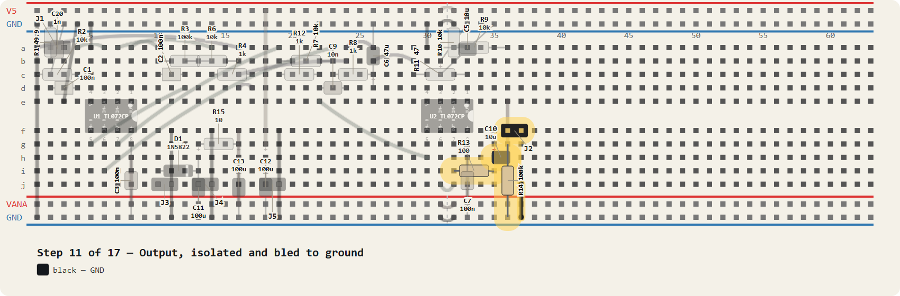

R13 and C10 hand the signal to the sound card through a series resistor, so a cable capacitance does not hang directly off an op-amp output. R14 bleeds the coupling cap so the jack is not left holding a charge, and J2 is the audio-left output to the interface.

| part | value | push it in at |
|---|---|---|
| R13 | 100 | 1→**i32**, 2→**i35** |
| C10 | 10u | 1→**h35**, 2→**h36** |
| R14 | 100k | 1→**g36**, 2→**BR-@36** |
| J2 | AUDIO L | 1→**f36**, 2→**f37** |

| wire | colour | from → to | what it does |
|---|---|---|---|
| 1 | black | **j37** → **BR-@37** | J2 GND |

> **Check before moving on.** Output DC near 0 V after C10. Finger on the input gives a hum: the amp is alive.

---

## Step 12 — Three 5 V feeds for the RF modules

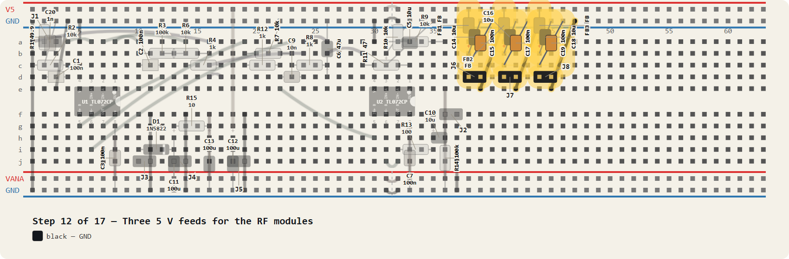

The ADF4351, the PA and the LNA each get a ferrite bead and their own 10 uF plus 100 nF pair, so one module's switching noise does not arrive at the next one along the rail. Identical blocks at columns 38, 41 and 44 — build one, check it, then repeat it twice.

| part | value | push it in at |
|---|---|---|
| FB1 | FB | 1→**TR+@38**, 2→**a38** |
| C14 | 10u | 1→**b38**, 2→**TR-@39** |
| C15 | 100n | 1→**c38**, 2→**TR-@40** |
| J6 | ADF4351 5V | 1→**d38**, 2→**d39** |
| FB2 | FB | 1→**TR+@41**, 2→**a41** |
| C16 | 10u | 1→**b41**, 2→**TR-@42** |
| C17 | 100n | 1→**c41**, 2→**TR-@43** |
| J7 | PA 5V | 1→**d41**, 2→**d42** |
| FB3 | FB | 1→**TR+@44**, 2→**a44** |
| C18 | 10u | 1→**b44**, 2→**TR-@45** |
| C19 | 100n | 1→**c44**, 2→**TR-@46** |
| J8 | LNA 5V | 1→**d44**, 2→**d45** |

| wire | colour | from → to | what it does |
|---|---|---|---|
| 1 | black | **e39** → **TR-@41** | J6 GND |
| 2 | black | **e42** → **TR-@44** | J7 GND |
| 3 | black | **e45** → **TR-@47** | J8 GND |

> **Check before moving on.** 5.00 V at all three of J6, J7, J8 with nothing plugged into them.

---

## Step 13 — The ESP32 header and its series resistors

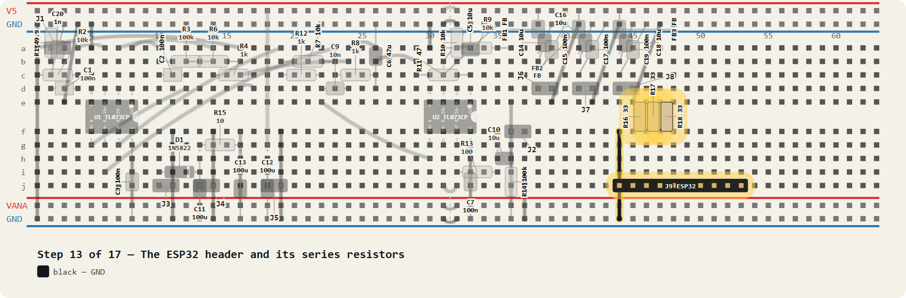

J9 is where the radar's ESP32 lands. R16 to R18 are 33 ohm series resistors on SCK, MOSI and LE: they damp the edges so a 2.54 mm breadboard run does not ring into the PLL's logic inputs. Each one hops the centre channel into the top bank.

| part | value | push it in at |
|---|---|---|
| J9 | ESP32 | 1→**j44**, 2→**j45**, 3→**j46**, 4→**j47**, 5→**j48**, 6→**j49**, 7→**j50**, 8→**j51**, 9→**j52**, 10→**j53** |
| R16 | 33 | 1→**f45**, 2→**e46** |
| R17 | 33 | 1→**f46**, 2→**e47** |
| R18 | 33 | 1→**f47**, 2→**e48** |

| wire | colour | from → to | what it does |
|---|---|---|---|
| 1 | black | **f44** → **BR-@44** | J9 pin 1 GND |

> **Check before moving on.** Each resistor reads 33 ohms between its two strips, and nothing else.

---

## Step 14 — SPI across to the ADF4351

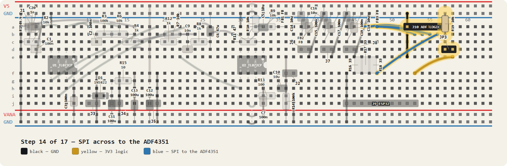

Four blue wires carry the damped SPI and the lock-detect line up to J10. R19 pulls CE down so the synthesiser's output stays OFF until something deliberately enables it, and JP3 is the link that enables it. The yellow wire brings 3V3 over from the ESP32 — the ADF4351 board is 3.3 V logic and needs no level shifting.

| part | value | push it in at |
|---|---|---|
| J10 | ADF LOGIC | 1→**a52**, 2→**a53**, 3→**a54**, 4→**a55**, 5→**a56**, 6→**a57** |
| R19 | 10k | 1→**b57**, 2→**TR-@57** |
| JP3 | CE EN | 1→**d57**, 2→**d58** |

| wire | colour | from → to | what it does |
|---|---|---|---|
| 1 | black | **e52** → **TR-@52** | J10 pin 1 GND |
| 2 | blue | **a46** → **b53** | R16 out (top col 46) -> J10 pin 2 SCK_O (col 53) |
| 3 | blue | **a47** → **b54** | R17 out (top col 47) -> J10 pin 3 MOSI_O (col 54) |
| 4 | blue | **a48** → **b55** | R18 out (top col 48) -> J10 pin 4 LE_O (col 55) |
| 5 | blue | **f48** → **b56** | J9 pin 5 LD (bottom col 48) -> J10 pin 5 LD (top col 56) |
| 6 | yellow | **f53** → **e58** | J9 pin 10 3V3 (bottom col 53) -> JP3 pin 2 (top col 58) |

> **Check before moving on.** With JP3 off, CE reads 0 V. The radar must boot with RF off.

---

## Step 15 — The A4988 stepper header

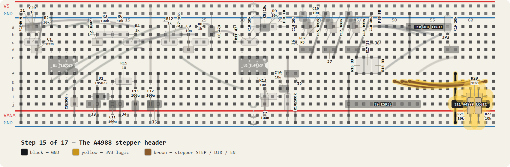

Only for the optional turntable; skip the whole step if you are not fitting one. R20 pulls EN up so the driver is disabled until the ESP32 says otherwise, and R21 and R22 pull STEP and DIR down so a floating input cannot make the motor twitch at power-up. The three brown wires are the control lines.

| part | value | push it in at |
|---|---|---|
| J11 | A4988 LOGIC | 1→**j58**, 2→**j59**, 3→**j60**, 4→**j61**, 5→**j62** |
| R20 | 10k | 1→**i59**, 2→**i62** |
| R21 | 10k | 1→**h60**, 2→**BR-@60** |
| R22 | 10k | 1→**h61**, 2→**BR-@61** |

| wire | colour | from → to | what it does |
|---|---|---|---|
| 1 | black | **f58** → **BR-@58** | J11 pin 1 GND |
| 2 | yellow | **g53** → **g59** | 3V3 -> J11 pin 2 / R20 (bottom col 59) |
| 3 | brown | **g50** → **g60** | J9 pin 7 STEP (col 50) -> J11 pin 3 (col 60) |
| 4 | brown | **g51** → **g61** | J9 pin 8 DIR (col 51) -> J11 pin 4 (col 61) |
| 5 | brown | **g52** → **g62** | J9 pin 9 EN (col 52) -> J11 pin 5 (col 62) |

> **Check before moving on.** EN sits at 3V3, STEP and DIR at 0 V, with the ESP32 unplugged.

---

## Step 16 — The SYNC divider back to the sound card

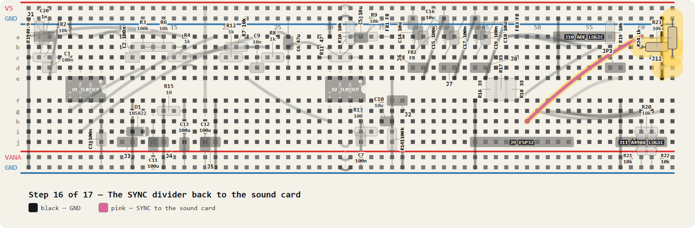

The last block, and the one that makes the whole radar measurable: R23 and R24 divide the ESP32's 3.3 V chirp marker down to about 0.3 V, which is a line-level signal the sound card's right channel can take. Without it the laptop cannot cut the beat signal into chirps and there is no range axis at all.

| part | value | push it in at |
|---|---|---|
| R23 | 10k | 1→**b60**, 2→**b63** |
| R24 | 1k | 1→**c63**, 2→**TR-@63** |
| J12 | AUDIO R | 1→**d63**, 2→**d62** |

| wire | colour | from → to | what it does |
|---|---|---|---|
| 1 | black | **e62** → **TR-@62** | J12 GND |
| 2 | pink | **h49** → **a60** | J9 pin 6 SYNC (bottom col 49) up to R23 (top col 60) |

> **Check before moving on.** A 135 Hz square wave of about 0.3 V at J12 once radar_ctl is running.

---

## Step 17 — Before you power anything

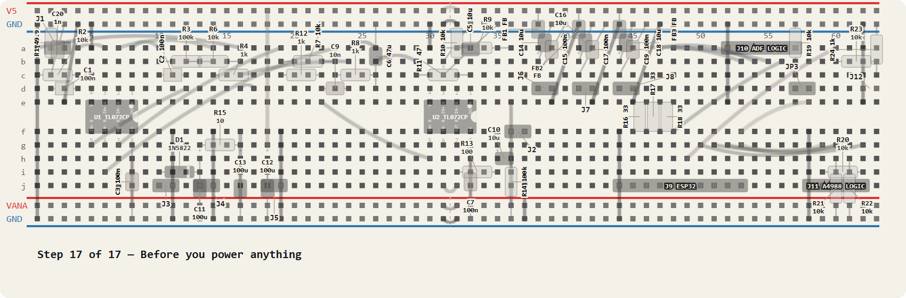

The board is finished. These are the measurements that catch a build error while it is still cheap, with the supply DISCONNECTED and nothing plugged into the headers.

> **Check before moving on.** Ohm-meter, all with power off: GND to VANA, GND to V5 and GND to 3V3 must each read open (over 1 kohm). Any of them near zero is a short — find it before you connect 12 V. Then work the test cards in hardware/spice/.

---

## When it is all in

The finished board: [`breadboard.png`](breadboard.png), every hole and net in
[`WIRING.md`](WIRING.md), and [`breadboard.html`](breadboard.html) if you want
to hover a part and see what it touches.

Simulate before you trust it — `../spice/README.md` has one test card per block,
with the stimulus and the reading to expect.

