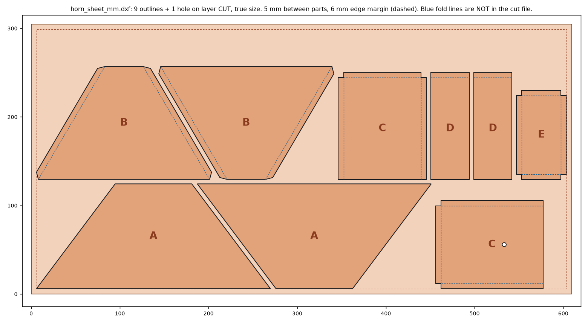

# Cutting the horn copper on an OMAX waterjet

One file cuts all nine pieces of one horn from one 12 × 24 in sheet of 24 ga
(0.021 in, 0.53 mm) copper. Run it three times, on three sheets, for the three
horns. Made by `../tools/make_waterjet.py` from the same horn geometry as the
printed templates, so the parts match the fabrication guide exactly.

## The files

| file | use it for |
|---|---|
| `horn_sheet_mm.dxf` | **the cut file**, millimetres. 9 outlines and the feed hole, all on layer `CUT`, nothing else. |
| `horn_sheet_inch.dxf` | the same drawing in inches, if the shop's LAYOUT is set up in inches. Use one or the other, not both. |
| `test_coupon_mm.dxf` | a 50 mm square with the 4.5 mm feed hole, plus a 6 × 40 mm strip (the size of a tab). **Cut this first.** |
| `horn_sheet_ref.dxf` | reference only, **never cut from it**: adds the sheet edge, the fold lines and the piece letters on their own layers. |

What to expect when it opens:

- **mm file:** the cut parts span 6.0 to 603.4 mm across and 6.0 to 256.8 mm up.
- **inch file:** the same span is 0.236 to 23.757 in across and 0.236 to 10.110 in up.
- **The origin:** the drawing's 0,0 is the sheet's lower-left corner, with the 24 in side along X.
- **Spacing:** pieces sit 5 mm apart and 6 mm in from the sheet edge.
- **Cut length:** about 4.2 m per sheet.

Outlines are drawn at the **true part size**. LAYOUT adds the kerf offset when it
makes the tool path, so do not offset anything yourself.

## On the machine's computer

1. **Open it in LAYOUT.** Open `horn_sheet_mm.dxf`. A DXF R12 file carries no units, so LAYOUT asks: choose **millimetres**. Check the overall size against the numbers above. If it comes in 25.4 times too big or too small, the units are wrong.
2. **Clean it up.** Run LAYOUT's clean-up tool. It should find nothing to fix: every outline is already one closed shape.
3. **Set the cut quality.** Select everything and set the finest quality (5). The sheet is thin, so even the slowest quality cuts fast, and these edges meet in soldered seams.
4. **Set the lead-ins.** Use automatic lead-ins and lead-outs, and check two things:
   - Every outline's lead sits on the scrap side, outside the part.
   - The 4.5 mm hole's lead starts at its centre.
5. **Make the tool path.** LAYOUT normally cuts holes before the outline around them; check that the feed hole is cut before its C piece. Save the `.OMX` file.
6. **Set up in MAKE.** Open the `.OMX` file in MAKE and choose **copper** from the material list, with thickness **0.021 in (0.53 mm)**. Let MAKE set the speeds and the kerf from the machine's own nozzle setup. Those settings belong to the shop's machine, not to this drawing.

## Holding thin copper

0.53 mm copper flaps in the jet and small pieces tip between the slats. So:

- **Use a backer.** Lay the sheet flat on a sacrificial backer: scrap aluminium or steel plate, or whatever the shop uses for thin stock. The jet cuts into the backer, which is what it is for.
- **Hold it down.** Weight the sheet down around the edges, inside the 6 mm margin is fine, clear of the cut paths.
- **Pierce gently.** If the machine has **low-pressure piercing**, use it. It stops the sheet bulging at the pierce.

## The order of work

1. **Cut `test_coupon_mm.dxf` first.** Measure it with calipers. The square should be 50.0 ± 0.15 mm both ways, the hole should take a 4.5 mm drill shank, and the strip should be 6.0 mm wide and flat. If the square is off, fix the kerf setting in MAKE before cutting a real sheet.
2. **Cut one horn sheet.** Check A and B against the fabrication guide before cutting the other two. Their slanted edges must both be 147.9 mm.
3. **Cut the other two sheets.**

## After cutting

- **Clean the parts.** Rinse off the abrasive and dry the parts straight away, then deburr the edges with a fine file or Scotch-Brite.
- **Write the piece letters on with a marker.** Every piece is symmetrical, so it does not matter which face was up.
- **Mark the fold lines by hand.** They are deliberately not cut: a jet that scores 0.53 mm copper cuts through it. Take them from `horn_sheet_ref.dxf` or the fabrication guide, then fold as in the assembly guide, step 3.
- **Drill the flange holes by hand.** The four 2.7 mm SMA flange holes are drilled through the flange as in the assembly guide, step 2, so they line up with your actual connector. The 4.5 mm feed hole is already cut, and more accurately than by hand.
- **Clean before soldering.** Clean the copper bright: waterjet-cut copper tarnishes quickly.

To regenerate after a design change: `python3 tools/make_waterjet.py` from `build/`.
It re-nests the pieces, refuses to write a sheet where parts touch or run off the
edge, then reads its own DXF back and checks every outline is closed, the hole
is inside the right piece and the A and B slant edges are 147.9 mm.
