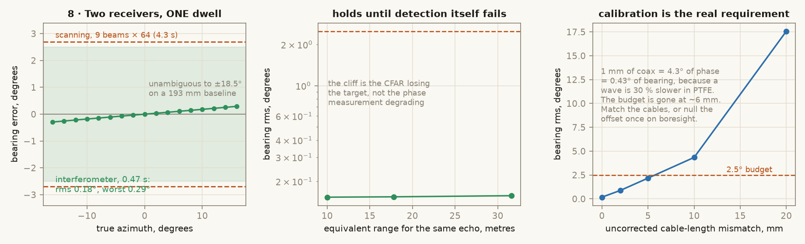

# Getting azimuth

Scanning the horns cannot give the bearing of a drone that is flying. The
centroid assumes every beam saw the target at one bearing, so the whole scan has
to finish before the bearing moves, and at 10 m with a 2.5° budget that caps a
4.3 s scan at a target speed of 0.10 m/s. Details and the measurement are in
[`signal-chain.md`](signal-chain.md) § stage 10.

> **But if the drone holds still, the scan does work — and it is the cheap way
> to get azimuth on stage 1 hardware.** Measured in
> [`figures/hover_scan.py`](figures/hover_scan.py): with the right geometry —
> **3 beams over 48°, 1.42 s**, not the 9 beams over 90° this repo used to
> specify — the scan holds the 2.5° budget out to **0.5 m/s** of sideways
> drift, against 0.15 m/s for the 9-beam version. A servo is $15–30 against
> $167–224 for the second receive chain. See § [the servo scan, and when it is
> enough](#the-servo-scan-and-when-it-is-enough) at the bottom.

The fix is to stop measuring bearing across time and measure it across
**space**: two receiving antennas, and the phase difference between them.

```
        RX A          RX B                 Δφ = 2π · d · sin(θ) / λ
          |<--- d --->|
           \    |    /                      θ = asin( Δφ · λ / 2π d )
            \   |   /
             \  |  /  θ                     one dwell, 0.47 s
              \ | /                         no moving parts
               \|/
             target
```

Both receivers see the same echo at the same instant, so the target is not
allowed to move during the measurement. The whole thing takes one dwell.

---

## It works, and by a wide margin



Measured by [`figures/interferometer.py`](figures/interferometer.py), which
drives the project's own signal generator and processing, three noise seeds per
point:

| | scanning, 9 beams × 64 | two receivers, one dwell |
|---|---|---|
| time per fix | 4.3 s | **0.47 s** |
| bearing error, rms | 1.5° | **0.09°** |
| bearing error, worst | 2.7° | **0.14°** |
| works on a moving target | no | yes |

That is 18× inside the 2.5° budget, and 9× faster. Thermal noise is nowhere
near the limit: the bearing stays under 0.1° until the echo weakens by 25 dB,
equivalent to pushing the drone out past 40 m, and the cliff after that is the
CFAR losing the target altogether, not the phase measurement degrading.

**Calibration is the actual requirement.** 1 mm of extra coax on one channel is
**4.3° of phase and 0.43° of bearing**. Not 3°: a wave travels about 30 % slower
in PTFE coax than in air, so a length difference sees the 84.7 mm wavelength
inside the cable, not the 121.9 mm one outside it. Beyond about **6 mm** of
uncorrected mismatch you are outside the budget. Either match the two cables
physically, or measure the fixed offset once against a reflector on boresight
and subtract it. A trihedral corner reflector is a good target for this and
prints in an afternoon.

---

## The geometry, and the one non-obvious constraint

Ambiguity sets the maximum baseline. The phase difference has to stay inside
±π across the beam, so:

```
d  ≤  λ / (2 · sin θ_max)  =  0.1219 / (2 × sin 17°)  =  209 mm
```

The horns are 263.8 mm wide across the aperture and 193.1 mm tall. Two of them
side by side in their normal orientation put the phase centres **263.8 mm**
apart, past the limit, and the bearing wraps beyond ±13.4° — inside the beam,
where it does real damage.

**So rotate all three horns 90°.** With the 193.1 mm dimension horizontal, two
receive horns can touch and still sit at a 193 mm baseline, which is
unambiguous to **±18.4°** and covers the 17° half-beam with room to spare. The
azimuth beamwidth changes from 36° to 34°, which is nothing, and the
polarisation rotates, which is fine as long as the transmit horn is rotated
with them.

The turntable is now optional and does nothing during a measurement. If you
fit one, it points the whole frame at a wider sector, moving between dwells and
never during one. Most indoor flying at 3–10 m fits inside a single 34° beam,
so it is the first thing to cut.

---

## What to buy

These are stage 2. Build them into the three-horn frame from
[`radar-hardware.md`](radar-hardware.md) § 7, which stage 1 already put up.

| item | ~$ | note |
|---|---|---|
| second mixer | 25–73 | a 1.5–4.5 GHz SMA module at ~$25, or the ZX05-43MH again |
| second 2-way splitter | 13 | LO to both mixers |
| 6 dB SMA pad, plus the spare SPF5189Z | 9 | **only if you used the ZX05-43MH.** Splitting the LO twice leaves +7 dBm against its +13 dBm rating; pad-then-amplify puts it back to +13. Cheap level-7 modules need neither |
| second 2400–2500 band-pass | 29 | in front of the second LNA |
| 4-input USB interface (UMC404HD) | 100 | beat A, beat B and sync on **one sample clock** |
| third horn | 0 | copper for three is already in BOM section B |
| second LNA | 0 | the SPF5189Z 4-pack covers it |
| second TL072 video channel | 0 | parts already in section C |
| **total** | **~167 with a cheap mixer, ~224 with the ZX05-43MH** | |

The 4-input interface is not substitutable *for this version*. Two UCA202s have
independent sample clocks, and a phase measurement between two independently
clocked converters means nothing. The switched version below needs only two
channels and runs on the UCA202 — but if you already bought the UMC404HD in
stage 1, as § 7 of the hardware doc advises, this line is already paid for.

---

## The software is written

`ground_station/interferometer.py`, wired into `radar_acquire.py`. Nothing to
implement: build the hardware and run it.

```
python radar_acquire.py --interferometer --ctl /dev/ttyUSB0 --f0-mhz 2440 --bw-mhz 40
python radar_acquire.py --switched      --ctl /dev/ttyUSB0    # RF-switch build
python radar_acquire.py --selftest --interferometer --st-az -8 --st-vel -1.8
python test_radar.py                                          # 34 cases, no hardware
```

Calibrate once, then forget it:

```
python radar_acquire.py --interferometer --calibrate --cal-az 0 --ctl /dev/ttyUSB0
```

Put a corner reflector on boresight, run that, and the fixed offset is measured
and written to `interferometer_cal.json`, reloaded on every later run. Re-check
it after anything is unplugged.

It abstains rather than guesses. A detection reports no bearing, with a reason,
when the phase is outside the ±18.4° cone, when one channel is far weaker at
that cell, or when switched mode is near its velocity fold. The fix is always
the strongest return: if that one has no trustworthy bearing the block reports
no fix at all, instead of promoting a weaker sidelobe that happens to have one.

See [`radar-software.md`](radar-software.md) § 9 for the details, including the
frame marker switched mode needs and the velocity limit it cannot escape.

---

## The cheaper version, and why it is not the first choice

One RF switch in front of a single receive chain, alternating antennas chirp by
chirp, costs about $30 instead of $215 and removes channel mismatch entirely,
because both measurements go through the same mixer and the same amplifier.

The catch is that the two measurements are then 7.4 ms apart, and in that time a
drone at 1.8 m/s advances its round-trip phase by 79°, against a signal that is
157° at the edge of the beam. That motion term has to be subtracted using the
measured velocity, which couples velocity error into bearing error: one velocity
bin of 0.13 m/s costs about 0.6° of bearing. It also halves the Doppler samples
per antenna.

It would probably work. It is more software risk for less money, and the
simultaneous version has the parts already costed, so start there.

---

## What this gives up

Elevation. One baseline measures one angle, and putting it horizontal spends it
on azimuth. Range, azimuth and radial velocity is a 2-D track on the floor
plane, which is what the console and the tracker already draw.

---

## The servo scan, and when it is enough

The interferometer is the right answer for a *flying* drone. It is not the only
answer, and it is not the cheap one, so this is the honest comparison.

| | servo scan, 48° / 3 beams | interferometer |
|---|---|---|
| extra hardware | one servo, **$15–30** | second mixer, splitter, band-pass, LNA, 4-in interface: **$167–224** |
| receive chains | the one stage 1 already has | two, phase-matched |
| time per fix | 1.42 s | **0.47 s** |
| bearing at rest | 0.74° rms | **0.09°** |
| holds 2.5° up to | **0.5 m/s** of drift | ≥ 1 m/s, and it is flat — one dwell has nothing to smear |
| needs calibration | no | yes, and it is 0.43° of bearing per mm of cable |
| fails on a perfectly still target | yes | yes — same cause |

**Build the servo version if** you want azimuth on stage 1 without buying a
second receive chain, and you are willing to fly a careful hover or put the
target on a stand. 0.5 m/s is a real hover for a drone that is being held in
place, and 0.74° at rest is well inside budget.

**It will not track a drone being flown.** A hand-flown 25 g quad indoors has no
optical flow and no GPS, so nothing is holding its position but you, and the
moment it is moving at a walking pace the scan is out of budget while the
interferometer has not noticed.

**The servo is not wasted either way.** It is how you measure the horn's actual
beam pattern, and it is how you sweep a corner reflector across boresight to
find the interferometer's fixed phase offset. Stage 2 keeps it as an optional
coverage aid ([`goal.md`](goal.md)); this is the other reason to have one.

### The trap in both methods

Neither can see a target with **exactly zero Doppler**, because
`range_doppler(bg_subtract=True)` subtracts the mean across chirps to kill the
TX leakage and the room, and a motionless target is indistinguishable from the
room. Measured, both give 8–9° of nonsense, and — worse — nothing abstains:
`radar_acquire.py` locks onto a leakage residue at 2.2 m and reports it with
SNR 49.7 and quality 1.0.

A real hover survives on rotor micro-Doppler and airframe jitter, and 0.05 m/s
of radial motion is enough to clear it. But if you are bench-testing against a
corner reflector, **the reflector has to be moving** — on a slow slide, or
swinging — or you are measuring the room.
