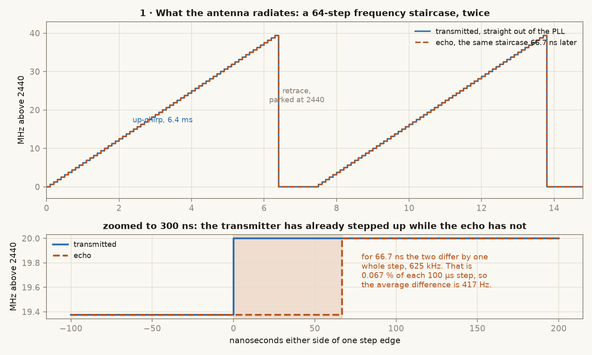
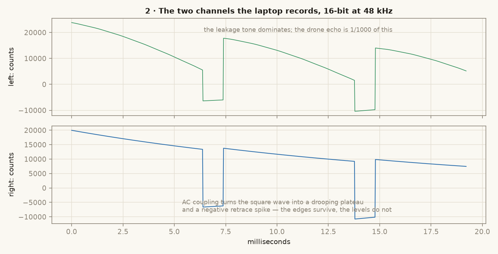
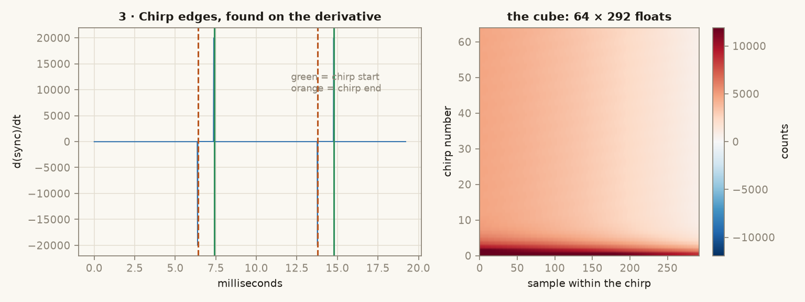
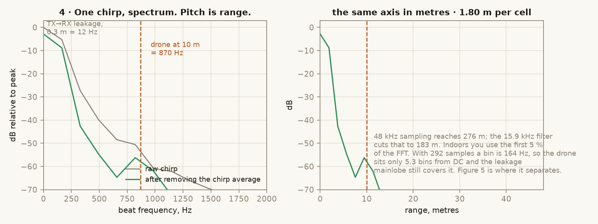
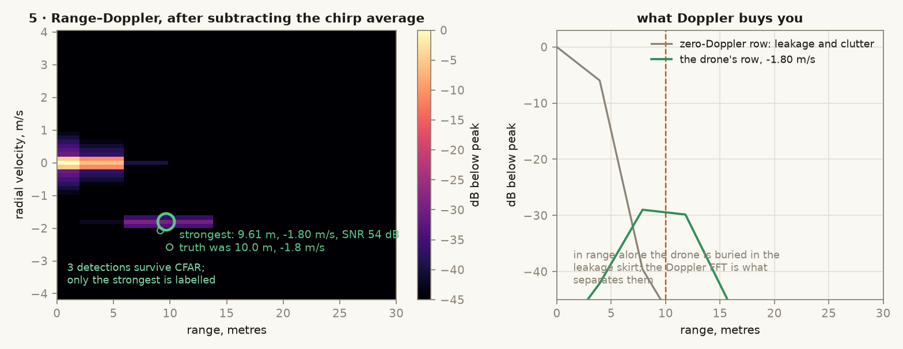
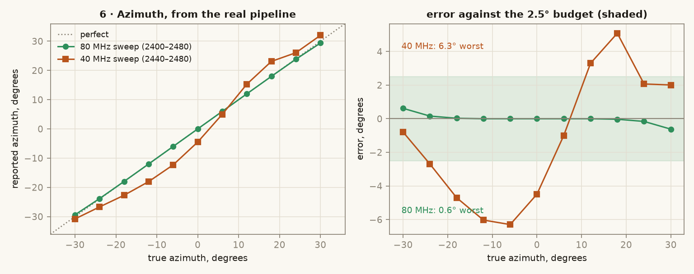
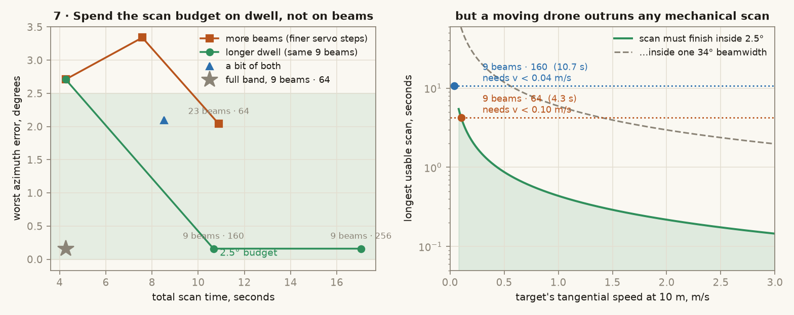

# What the signal actually is, at every point in the chain

This radar never measures time of flight. A drone 10 m away returns its echo
66.7 nanoseconds later, and nothing on this bench can time that. Instead the
transmitter is always changing frequency, so by the time the echo arrives the
transmitter has moved on, and the **difference between the two frequencies** is
what gets measured. That difference is an audio tone. The whole machine exists
to turn a distance into a pitch and then measure the pitch.

Every figure below is generated by
[`figures/make_figures.py`](figures/make_figures.py) from the same code that
runs on live audio, not drawn by hand.

---

## The one idea



The ADF4351 is not swept smoothly. It is re-tuned 64 times, 625 kHz per step,
100 µs per step, which walks 2440 MHz up to 2480 MHz in 6.4 ms, then parks back
at 2440 for 1 ms and does it again.

The echo is that identical staircase, delayed. At the top of the figure the two
traces sit on top of each other because 66.7 ns is invisible at millisecond
scale. The lower panel zooms to 300 ns across one step edge, which is where the
measurement actually lives: for 66.7 ns out of every 100 µs step the transmitter
has stepped up and the echo has not, so the two differ by one whole step of
625 kHz. That is 0.067 % of the time, and the average difference is:

```
f_beat = 2 · B · R / (c · T_up) = 41.70 Hz per metre of range
```

| range | beat tone |
|---|---|
| 3 m | 125 Hz |
| 10 m | 417 Hz |
| 30 m | 1.25 kHz |

Range **resolution** is set by the sweep width alone, `c / 2B` = **3.75 m**, and
nothing downstream can improve it.

---

## The chain, as data

| # | where | what the data is | size |
|---|---|---|---|
| 1 | ADF4351 output | 2440–2480 MHz, +5 dBm | — |
| 2 | TX horn | 0.2 W EIRP over a 34° beam | — |
| 3 | RX horn | the same staircase, 66.7 ns late, −80 dBm | — |
| 4 | mixer IF | one audio tone per target, 417 Hz at 10 m, 40 µV pk | — |
| 5 | video amp out | the same tone at 19 mV pk | — |
| 6 | sound card | 2 channels, 16-bit, 48 kHz | **92 KB** per block |
| 7 | after segmentation | 64 × 292 float array | **146 KB** |
| 8 | after two FFTs | 64 × 146 range–Doppler map, dB | **73 KB** |
| 9 | after CFAR | a list of (range, velocity, SNR) | ~300 B |
| 10 | after the beam scan | one fix: range, azimuth, velocity | ~100 B |

A block is 64 chirps, 473 ms. A full 9-beam scan is 4.3 s. The funnel from
92 KB of audio down to a 100-byte answer is the entire job of the software.

---

## Stage 6 — what the laptop really records



Two channels of ordinary 16-bit audio.

**Left** is the beat signal. It looks nothing like a clean 417 Hz tone because
it is not one: the transmit horn leaks straight into the receive horn about
0.3 m away, and that path produces its own beat at roughly 12 Hz that arrives
**46 dB stronger** than the drone. What you see is almost entirely leakage.

**Right** is the sync square wave from GPIO25, high for the up-chirp and low for
the retrace. The sound card's input is AC coupled, so the square wave arrives as
a drooping plateau followed by a negative spike. Its **levels are meaningless**
and its **edges are exact**, which decides how the next stage works.

---

## Stage 7 — cutting the stream into chirps



The software differentiates the sync channel and finds the jumps, rather than
thresholding a level that AC coupling has already destroyed. Rising edges are
chirp starts, falling edges are chirp ends.

Two timings come out of this, and they are **not the same number**:

| measured | value | used for |
|---|---|---|
| `T_up`, the up-chirp | 6.396 ms | the beat → range scale |
| `PRI`, chirp to chirp | 7.396 ms | the velocity axis |

Both are measured on every block rather than assumed, so changing `step_us` on
the ESP32 needs no matching change on the laptop. The first 5 % of each chirp is
dropped while the PLL settles, leaving 292 samples, and the per-chirp mean is
removed. The result is a 64 × 292 array: **one row per chirp, one column per
sample**.

---

## Stage 8a — the range FFT, and why it is not enough



Fourier transform one row and the frequency axis becomes a range axis. The
target is at 417 Hz, marked.

It is not the peak. With 292 samples a bin is 164 Hz wide, so the drone sits
**2.7 bins from DC**, still inside the mainlobe of the leakage. Subtracting the
average of all 64 chirps removes the static part of the leakage, which is the
green trace, and it is still not enough on its own.

Note also how little of this FFT is used. 48 kHz sampling reaches 576 m and the
15.9 kHz anti-alias filter cuts that to 381 m, so an indoor target lives in the
first 5 % of the bins. The sound card is not the limit anywhere in this design.

---

## Stage 8b — the Doppler FFT, which is what actually finds it



Now transform **down the columns**, across the 64 chirps. A target moving
towards the horns advances its phase a little on every chirp; the leakage and
the walls do not. That second transform sorts everything by velocity.

The right panel is the payoff. In the zero-Doppler row the leakage peaks near
4 m. In the drone's own row, at −1.80 m/s, the peak has moved to 10 m where it
belongs. **Range alone could not separate them; Doppler could.**

| axis | resolution | unambiguous span |
|---|---|---|
| range | 3.75 m | 381 m (filter limited) |
| velocity | 0.13 m/s | ±4.12 m/s |

The velocity window is set by the PRI, so a drone crossing faster than about
4 m/s aliases in velocity. Range is unaffected.

Cell-averaging CFAR then compares each cell to its neighbours and keeps whatever
stands 15 dB above the local background. Zero Doppler is skipped entirely, since
that is where leakage and static clutter live. On this block it returns 13
detections, of which the strongest is **9.64 m, −1.80 m/s, SNR 54 dB** against a
truth of 10.0 m and −1.8 m/s.

---

## Stage 10 — azimuth, and where this configuration breaks

The horns have a 34° beam, which is far too wide to point at a drone. Azimuth
comes instead from scanning: the turntable steps through 9 positions, a full
block is captured at each, and the target's azimuth is the amplitude-weighted
centroid across beams. That gives a bearing much finer than the beamwidth.

It does not currently work at the bandwidth this project is configured for.



Run the real pipeline against a target at known azimuths and the original
80 MHz sweep tracks truth to within **0.6°**. The 40 MHz coexistence sweep,
adopted so the drone's WiFi could live below it, is off by up to **6.3°**, well
outside the 2.5° budget. `radar_acquire.py --selftest` fails on azimuth for this
reason.

The cause is **not** what I first assumed. Widening or tightening the
centroid's grouping window changes nothing at all: from 1.5 range cells down to
0.3 the answer is identical. The error is not a systematic bias from swallowing
false alarms. It is **variance**. Halving the bandwidth moves the target from
5.3 FFT bins from DC to 2.7, deeper into the leakage mainlobe of figure 4, which
makes every beam's amplitude estimate noisier, and the centroid is a weighted
average of exactly those amplitudes.

That diagnosis says how to fix it, and it is not by moving the servo more.

### Where the scan-time budget should go

A scan costs `n_beams × n_chirps × PRI` seconds. That budget can buy finer servo
steps or longer dwells. Measured, over three noise seeds, by
[`figures/scan_budget.py`](figures/scan_budget.py):



| configuration | scan time | rms error | worst |
|---|---|---|---|
| 9 beams × 64 chirps | 4.3 s | 1.5° | 2.7° |
| 16 beams × 64 | 7.6 s | 1.5° | 3.3° |
| 23 beams × 64 | 10.9 s | 0.9° | 2.0° |
| 12 beams × 96 | 8.5 s | 0.7° | 2.1° |
| **9 beams × 160** | **10.7 s** | **0.1°** | **0.2°** |
| 9 beams × 256 | 17.1 s | 0.1° | 0.2° |
| 9 beams × 64, at 80 MHz | 4.3 s | 0.1° | 0.2° |

Finer servo steps do help: tripling the beam count takes the worst error from
2.7° to 2.0°. But for the same ten seconds, **staying at 9 beams and dwelling
2.5× longer takes it to 0.2°**, an order of magnitude better.

That is what a variance-limited estimator looks like. The horns have a 34° beam,
so 12° steps already sample the beam pattern three times over; adding more
samples of a smooth curve you have already oversampled buys almost nothing,
while making each sample quieter buys everything. Note also that 160 chirps at
40 MHz lands exactly where 64 chirps at 80 MHz already was. Integration time
buys back precisely what the halved bandwidth cost.

> **Every number in this table is for a target pinned at one range and one
> bearing for the whole scan.** That is the right experiment for "how precise
> is the centroid", and the wrong one for "does this work on a drone". Let the
> target move even slightly and the ranking inverts — the 10.7 s row, the best
> one here, becomes the worst. See § [does it work on a hovering
> drone](#does-it-work-on-a-hovering-drone) below, which measures it.

### The limit that outranks both

None of this survives a moving target. The centroid assumes every beam saw the
drone at the same bearing, so the scan has to finish before the drone's bearing
changes by more than the budget:

```
t_scan  <  θ · R / v_tangential
```

At 10 m and a 2.5° budget that is 0.44 seconds per metre per second of
crosswise speed. The 4.3 s scan therefore needs the drone slower than
**0.10 m/s**, and the 10.7 s scan needs **0.04 m/s**. Both mean a drone that is
essentially parked. Even the loose test, finishing within one 34° beamwidth,
caps the 4.3 s scan at 1.4 m/s.

So mechanical scanning is a way to measure the bearing of a **hovering** drone.
It is not a way to track a flying one, at any dwell or step size, and no amount
of servo tuning changes that. What servo tuning *does* change is how good the
hover has to be, and that turns out to be worth a factor of three — measured
next. Bearing on a moving target needs it measured
within a single dwell, which is what stage 2 does with a second receive horn and
the phase difference between them. This finding is an argument for going
there sooner rather than for optimising the scan.

### Does it work on a hovering drone?

The table above never let the target move. This one does, using the same
pipeline, in [`figures/hover_scan.py`](figures/hover_scan.py) — the target's
range and bearing are advanced between beams, so the centroid sees what it
would really see. 16 assertions in `--selftest` hold the conclusions below to
the saved results.

**First: "perfectly still" is the one case that fails outright.** The
range-Doppler map is background-subtracted — `range_doppler(bg_subtract=True)`
does `c -= c.mean(axis=0)` — which is what removes the TX leakage and the room.
A target with no radial velocity is removed with them.

| radial velocity | 4.3 s scan | one dwell, interferometer |
|---|---|---|
| **0.00 m/s** | **8.9° rms** | **8.5° rms** |
| 0.02 m/s | 7.9° | 8.5° |
| 0.05 m/s | 2.2° | **0.13°** |
| 0.10 m/s | 0.26° | 0.11° |

Worse than the error: nothing abstains. At exactly zero Doppler
`radar_acquire.py` locks onto a leakage residue at 2.2 m and reports it as the
fix with SNR 49.7 and quality 1.0. So *"hold it as still as you can"* is
actively the wrong instruction. A real hover is never that still — rotors and
airframe jitter keep it out of the DC bin — and **0.05 m/s is enough**.

**Second: it is drift speed that matters, not how long you hold.** With enough
jitter to be visible (0.15 m/s radial), sweeping the sideways drift:

| sideways drift | 4.3 s scan (9 beams) | 10.7 s scan (9 × 160) | interferometer |
|---|---|---|---|
| 0 | **0.20°** | 3.12° | 0.09° |
| 0.05 m/s | 0.36° | 3.46° | 0.09° |
| 0.10 m/s | 0.95° | 4.03° | 0.09° |
| 0.20 m/s | 2.12° ✗ | 6.85° ✗ | 0.09° |
| 0.50 m/s | 6.04° ✗ | 18.2° ✗ | 0.09° |
| 1.00 m/s | 13.6° ✗ | 32.5° ✗ | **0.09°** |

The 10.7 s configuration — the best row in the previous table, at 0.09° — is
**the worst one here**, because smear and range walk both grow with scan time.
Its 0.09° was an artefact of pinning the target's range. The interferometer is
flat: one dwell, so drift has nothing to act on.

**Third: the 9-beam geometry is the wrong one.** A scan costs time in
proportion to its beam count, and 12° steps oversample a 36° beam. Spending
fewer beams buys drift tolerance far faster than the coarser centroid loses
accuracy:

| sector / beams | scan | at rest | 0.20 m/s | 0.50 m/s | holds 2.5° to |
|---|---|---|---|---|---|
| 90° / 9 *(as specified)* | 4.26 s | **0.20°** | 2.12° ✗ | 6.04° ✗ | 0.15 m/s |
| 90° / 5 | 2.37 s | 0.50° | 1.12° | 2.90° ✗ | 0.30 m/s |
| 72° / 7 | 3.32 s | 0.20° | 1.53° | 4.31° ✗ | 0.25 m/s |
| 48° / 5 | 2.37 s | 0.69° | 1.08° | 2.47° ✗ | 0.40 m/s |
| **48° / 3** | **1.42 s** | 0.74° | **0.82°** | **1.54°** | **0.50 m/s** |
| 36° / 4 | 1.89 s | 1.77° ✗ | 1.86° ✗ | 2.36° ✗ | never |

**Three beams at −24°, 0°, +24° is the configuration to build.** It is worse
than 9 beams on a parked target and three times better on a drifting one, with
the crossover at about 0.1 m/s — and it is a third of the scan time and a third
of the servo moves.

The last row is the guard rail: 36° is barely wider than the ±12° the targets
span, so the centroid gets squeezed toward the middle and fails even at rest.
Fewer beams is not the lesson; **a sector comfortably wider than the target's
excursion, sampled just often enough**, is.

### What to do now

- **Range and velocity are unaffected.** They are accurate throughout;
  only bearing is in question, and only for moving targets.
- **If you keep the 40 MHz sweep**, change the scan *geometry*, not the dwell:
  **3 beams over 48°, 64 chirps, 1.42 s**. Measured below, that holds the
  budget out to 0.5 m/s of drift where the 9-beam scan gives up at 0.15.
  Raising the dwell to 160 chirps was the earlier advice here and it is
  **withdrawn** — it only helps a target that does not move.
- **If you reclaim the bandwidth**, nothing else needs changing.
- **For a moving drone**, neither helps. Bearing has to come from one dwell,
  which means two receivers and the phase between them:
  [`azimuth.md`](azimuth.md) measures it at 0.09° rms in 0.47 s, against
  1.5° in 4.3 s for the scan.

---

## The equations, in one place

| quantity | expression | this build |
|---|---|---|
| beat frequency | `2·B·R / (c·T_up)` | 41.70 Hz per metre |
| range resolution | `c / 2B` | 3.75 m |
| target's FFT bin | `2·B·R / c` | 2.67 bins at 10 m |
| velocity resolution | `λ / (2·N·PRI)` | 0.13 m/s |
| unambiguous velocity | `± λ / (4·PRI)` | ±4.12 m/s |
| max range from sampling | `c·T_up·f_s / (4·B)` | 576 m |
| max range from the filter | `c·T_up·f_LP / (2·B)` | 381 m |

---

## Reproducing all of this

```
cd docs/figures && python3 make_figures.py       # every figure, plus the numbers
cd ground_station && python3 radar_acquire.py --selftest --f0-mhz 2440 --bw-mhz 40 \
    --st-range 10 --st-az -12 --st-vel -1.8      # currently FAILS on azimuth
```

Swap `--f0-mhz 2400 --bw-mhz 80` and the same self-test passes, which is the
cleanest demonstration that the fault is the narrow sweep and not the DSP.

Related sheets: [`hardware/kicad/radar_flow.kicad_sch`](../hardware/kicad/) for
how the hardware blocks connect,
[`radar-software.md`](radar-software.md) for the code, and
[`testing.md`](testing.md) for the bench procedure.
